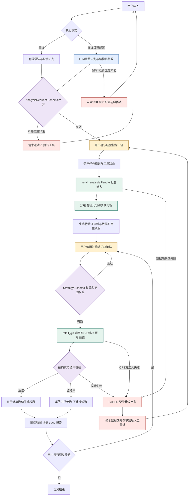

# Agent 技术工作流

采用受控流程。蓝色为可选LLM决策，绿色为确定性工具，黄色为人工节点，紫色为验证，红色为异常恢复。离线规则不属于LLM决策。当前工具选择由阶段路由，未实现自由规划。

```mermaid
flowchart TD
    A[用户输入] --> B{执行模式}
    B -- 离线 --> C[有限语法与缺参识别]
    B -- 在线且已配置 --> D[LLM意图识别与结构化参数]
    D --> E{AnalysisRequest Schema校验}
    C --> E
    D -- 超时 拒绝 无效响应 --> X[安全错误 提示配置或切离线]
    X --> A
    E -- 不完整或非法 --> Y[请求澄清 不执行工具]
    Y --> A
    E -- 有效 --> F[用户确认经营指标口径]
    F --> G[受控任务规划与工具路由]
    G --> H[retail_analysis Pandas汇总排名]
    H --> I[分组 特征比较和关联分析]
    I --> J[生成待验证规则与数据可用性说明]
    J --> K[用户编辑并确认拓店策略]
    K --> L{Strategy Schema 权重和范围校验}
    L -- 非法 --> K
    L -- 有效 --> M[retail_gis 调用原GIS缓冲 距离 叠置]
    M --> N{硬约束与结果校验}
    N -- 通过 --> O[从已计算数值生成解释]
    O --> P[前端地图 详情 trace 报告]
    N -- 空结果 --> Q[返回排除计数 不补造候选]
    Q --> P
    H -- 数据缺失或失败 --> R[FAILED 记录错误类型]
    M -- CRS或工具失败 --> R
    N -- 校验失败 --> R
    R --> S[修复数据或修改参数后人工重试]
    S --> F
    P --> T{用户是否调整策略}
    T -- 是 --> K
    T -- 否 --> U[任务结束]
    classDef llm fill:#e5efff,stroke:#376cad
    classDef tool fill:#e5f4ed,stroke:#126b59
    classDef human fill:#fff1cf,stroke:#a77722
    classDef verify fill:#eee5f7,stroke:#73509a
    classDef failure fill:#ffe7e5,stroke:#b64b44
    class D llm
    class H,I,M tool
    class F,K human
    class E,L,N verify
    class X,Y,R,S failure
```
