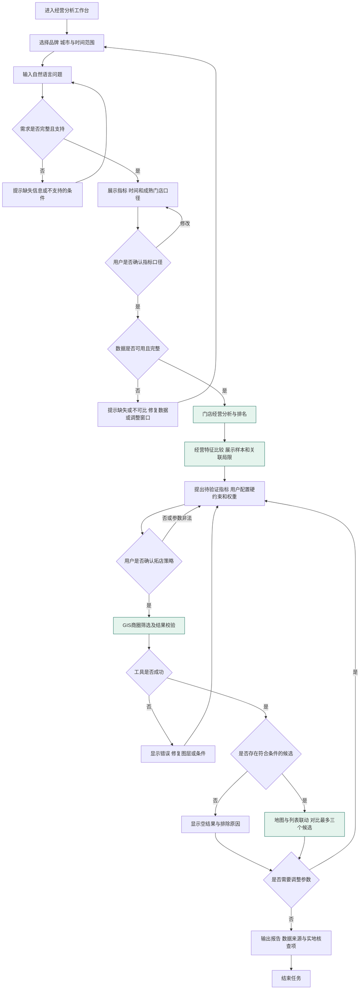

# 业务流程

绿色阶段是业务计算；所有数据均为明确标注的模拟数据。用户可随时返回配置，但重算必须再次提交确认。

```mermaid
flowchart TD
    A[进入经营分析工作台] --> B[选择品牌 城市与时间范围]
    B --> C[输入自然语言问题]
    C --> D{需求是否完整且支持}
    D -- 否 --> E[提示缺失信息或不支持的条件]
    E --> C
    D -- 是 --> F[展示指标 时间和成熟门店口径]
    F --> G{用户是否确认指标口径}
    G -- 修改 --> F
    G -- 是 --> H{数据是否可用且完整}
    H -- 否 --> I[提示缺失或不可比 修复数据或调整窗口]
    I --> B
    H -- 是 --> J[门店经营分析与排名]
    J --> K[经营特征比较 展示样本和关联局限]
    K --> L[提出待验证指标 用户配置硬约束和权重]
    L --> M{用户是否确认拓店策略}
    M -- 否或参数非法 --> L
    M -- 是 --> N[GIS商圈筛选及结果校验]
    N --> O{工具是否成功}
    O -- 否 --> P[显示错误 修复图层或条件]
    P --> L
    O -- 是 --> Q{是否存在符合条件的候选}
    Q -- 否 --> R[显示空结果与排除原因]
    R --> S{是否需要调整参数}
    Q -- 是 --> T[地图与列表联动 对比最多三个候选]
    T --> S
    S -- 是 --> L
    S -- 否 --> U[输出报告 数据来源与实地核查项]
    U --> V[结束任务]
    classDef compute fill:#e5f4ed,stroke:#126b59
    class J,K,N,T compute
```
