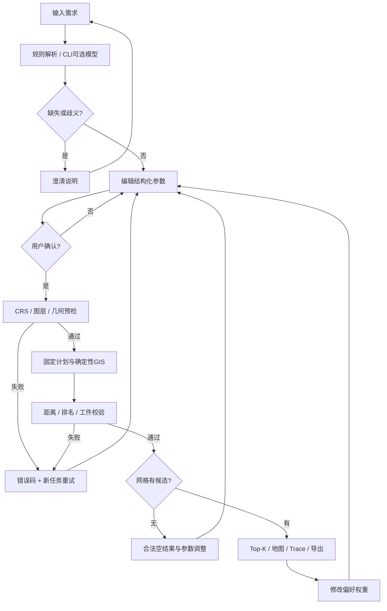

# 用户流程

```mermaid
flowchart TD
 A[输入需求] --> B[规则解析 / CLI可选模型]
 B --> C{缺失或歧义?}
 C -->|是| D[澄清说明]
 D --> A
 C -->|否| E[编辑结构化参数]
 E --> F{用户确认?}
 F -->|否| E
 F -->|是| G[CRS / 图层 / 几何预检]
 G -->|失败| H[错误码 + 新任务重试]
 H --> E
 G -->|通过| I[固定计划与确定性GIS]
 I --> J[距离 / 排名 / 工件校验]
 J -->|失败| H
 J -->|通过| K{网格有候选?}
 K -->|无| L[合法空结果与参数调整]
 L --> E
 K -->|有| M[Top-K / 地图 / Trace / 导出]
 M --> N[修改偏好权重]
 N --> E
```

Web执行为同步请求，完成后展示全部阶段Trace；不包含真实逐阶段推送。重试始终生成新的run_id。CLI `--confirm`跳过交互确认，明确由调用者预确认。
